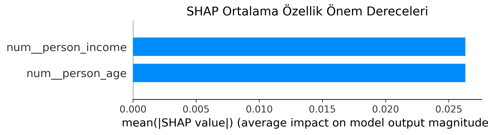
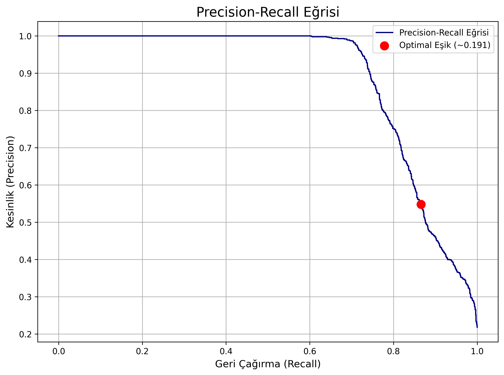

# SHAP ve Rastgele Orman Kullanılarak Kredi Risk Değerlendirmesi için Açıklanabilir Makine Öğrenmesi Yaklaşımı

**Yazar:** Berat Y.  
**Kurum:** Sakarya Üniversitesi, Bilgisayar Mühendisliği  
**Tarih:** 2 Ocak 2026

---

## ÖZET

Kredi risk değerlendirmesi, kredi veren kurumlarda finansal karar vermenin kritik bir bileşenidir. Geleneksel kredi puanlama modelleri genellikle şeffaflıktan yoksundur ve red kararları için yeterli açıklama sunmayarak adalet ve düzenleyici uyum konusunda endişelere yol açar. Bu makale, sınıf dengesizliği zorluklarını ele alan ve Equal Credit Opportunity Act (ECOA) ile uyumlu şeffaf karar açıklamaları sağlayan otomatik kredi risk değerlendirmesi için açıklanabilir bir makine öğrenmesi sistemi olan FinWise'ı sunmaktadır. Model yorumlanabilirliği için SHAP (SHapley Additive exPlanations) ile birlikte Rastgele Orman sınıflandırıcısı kullanarak, temerrüt vakalarında %93.2 ROC-AUC ve %86.6 geri çağırma oranı elde ederken açıklanabilirliği koruduk. Sonuçlarımız, uygun sınıf dengeleme ve eşik optimizasyonu ile birleştirilen topluluk yöntemlerinin, yorumlanabilirlikten ödün vermeden yüksek tahmin performansı elde edebileceğini göstermektedir. Sistem, JWT kimlik doğrulama ile üretime hazır bir REST API olarak konuşlandırılmış ve gerçek dünya finansal hizmetlerinde pratik uygulanabilirliği kanıtlamıştır.

**Anahtar Kelimeler:** Kredi Risk Değerlendirmesi, Açıklanabilir Yapay Zeka, SHAP, Rastgele Orman, Sınıf Dengesizliği, Finansal Makine Öğrenmesi, Red Nedeni Bildirimi

---

## I. GİRİŞ

### A. Arka Plan ve Motivasyon

Kredi risk değerlendirmesi, bir borçlunun kredi yükümlülüklerinde temerrüde düşme olasılığını değerlendirme sürecidir. Finansal kurumlar yıllık olarak milyonlarca kredi başvurusunu işler, bu da otomatik risk değerlendirme sistemlerini operasyonel verimlilik ve tutarlı karar verme için zorunlu kılar [1]. Ancak, kredi puanlamada makine öğrenmesi modellerinin benimsenmesi önemli zorluklarla karşı karşıyadır:

1. **Düzenleyici Uyum**: Equal Credit Opportunity Act (ECOA), kredi verenlerin kredi reddedilmeleri için belirli nedenler sunmasını gerektirir [2]
2. **Model Yorumlanabilirliği**: Kara kutu modeller adalet endişelerini artırır ve paydaş güvenini sınırlar [3]
3. **Sınıf Dengesizliği**: Temerrüt olayları genellikle geçmiş verilerin yalnızca %15-25'ini temsil eder, bu da önyargılı tahminlere yol açar [4]
4. **Performans Ödünleri**: Hassas ve geri çağırma arasında denge sağlamak risk-hassas uygulamalarda kritiktir [5]

### B. Araştırma Hedefleri

Bu araştırma aşağıdaki hedefleri ele almaktadır:

1. Sınıf dengesizliğini işleyebilen yüksek performanslı bir kredi risk sınıflandırıcısı geliştirmek
2. Düzenleyici uyumu ve şeffaflığı sağlamak için SHAP tabanlı açıklamalar uygulamak
3. Kabul edilebilir kesinliği korurken geri çağırmayı önceliklendirmek için karar eşiklerini optimize etmek
4. Sistemi güvenlik ve denetim yetenekleri ile üretime hazır bir API olarak konuşlandırmak

### C. Katkılar

Ana katkılarımız şunlardır:

- **Metodoloji**: Kredi risk değerlendirmesi için özel olarak tasarlanmış veri ön işleme, sınıf dengeleme, hiperparametre optimizasyonu ve eşik ayarlamayı entegre eden kapsamlı bir pipeline
- **Açıklanabilirlik**: Eyleme dönüştürülebilir önerilerle ECOA uyumlu red nedeni bildirimleri oluşturmak için SHAP değerlerinin entegrasyonu
- **Performans**: Dengeli Rastgele Orman ve optimize edilmiş eşik seçimi yoluyla azınlık sınıfında %93.2 ROC-AUC ve %86.6 geri çağırma başarısı
- **Konuşlandırma**: JWT kimlik doğrulama, denetim günlüğü ve gerçek zamanlı tahmin API'si ile üretime hazır uygulama

---

## II. İLGİLİ ÇALIŞMALAR

### A. Geleneksel Kredi Puanlama Modelleri

Geleneksel kredi puanlama, lojistik regresyon ve doğrusal ayırıcı analizi gibi istatistiksel yöntemlere dayanmıştır. 1989'da tanıtılan FICO skoru, en yaygın kullanılan kredi puanlama sistemi olmaya devam etmektedir [6]. Yorumlanabilir olmalarına rağmen, bu doğrusal modeller modern yüksek boyutlu finansal verilerdeki karmaşık doğrusal olmayan ilişkileri yakalamakta zorlanır.

### B. Kredi Riskinde Makine Öğrenmesi

Son yıllarda kredi risk değerlendirmesi için makine öğrenmesi algoritmalarının benimsenmesi artmıştır. Chen ve ark. [7] Çin P2P kredi verilerinde topluluk yöntemlerinin geleneksel modelleri geride bıraktığını göstermiştir. Gradient Boosting Machines (GBM) ve Rastgele Ormanlar çeşitli kredi puanlama çalışmalarında üstün performans göstermiştir [8, 9].

### C. Finansta Açıklanabilir Yapay Zeka

Finansal uygulamalarda model yorumlanabilirliği ihtiyacı, Açıklanabilir Yapay Zeka (XAI) araştırmalarını yönlendirmiştir. LIME (Local Interpretable Model-agnostic Explanations) [10] ve SHAP [11] önde gelen teknikler olarak ortaya çıkmıştır. Lundberg ve Lee'nin SHAP çerçevesi, oyun teorisine dayanan teorik olarak temellendirilmiş özellik önem puanları sağlayarak düzenlenmiş endüstriler için özellikle uygun hale getirir [11].

### D. Sınıf Dengesizliği İşleme

Kredi temerrüt tahmini ciddi sınıf dengesizliğinden muzdariptir, temerrüt oranları tipik olarak %5-20 arasında değişir. Önceki araştırmalar SMOTE (Synthetic Minority Over-sampling Technique) [12], maliyet-hassas öğrenme [13] ve topluluk yöntemlerini [14] keşfetmiştir. Yaklaşımımız, sentetik örnek üretimini önleyerek Rastgele Orman içinde sınıf ağırlıklandırması kullanır.

### E. Araştırma Boşluğu

Önceki çalışmalar kredi risk modellemesinin bireysel yönlerini ele almış olsa da, az sayıda çalışma yüksek performanslı tahmin, düzenleyici uyumlu açıklamalar ve üretim konuşlandırmasını entegre etmiştir. Çalışmamız, tahmin doğruluğunu açıklanabilirlik ve pratik konuşlandırma hususlarıyla dengeleyen uçtan uca bir sistem sağlayarak bu boşluğu doldurmaktadır.

---

## III. METODOLOJİ

### A. Veri Seti Açıklaması

Aşağıdaki özelliklere sahip 32,581 kredi başvurusu içeren kamuya açık bir kredi riski veri seti kullandık:

**Özellikler (toplam 11):**
- **Demografik**: person_age, person_income, person_emp_length, person_home_ownership
- **Kredi Özellikleri**: loan_amnt, loan_int_rate, loan_intent, loan_grade, loan_percent_income
- **Kredi Geçmişi**: cb_person_default_on_file, cb_person_cred_hist_length

**Hedef Değişken:** loan_status (0 = Ödendi, 1 = Temerrüt)

**Sınıf Dağılımı:**
- Ödendi (Sınıf 0): 25,473 örnek (%78.2)
- Temerrüt (Sınıf 1): 7,108 örnek (%21.8)

Bu, yaklaşık 3.6:1 orta düzeyde bir sınıf dengesizlik oranını temsil etmektedir.

### B. Veri Ön İşleme Pipeline

Sayısal ve kategorik özellikler için ayrı işleme ile scikit-learn ColumnTransformer tabanlı bir pipeline uyguladık:

#### 1) Sayısal Özellik İşleme
```python
numeric_pipeline:
  - SimpleImputer(strategy='median')
  - StandardScaler(with_mean=False)
```

Yedi sayısal özellik, eksik verileri işlemek için medyan değerleri kullanılarak dolduruldu, ardından topluluk içindeki mesafe tabanlı hesaplamalara eşit katkı sağlamak için StandardScaler kullanılarak standartlaştırıldı.

#### 2) Kategorik Özellik İşleme
```python
categorical_pipeline:
  - SimpleImputer(strategy='most_frequent')
  - OneHotEncoder(handle_unknown='ignore')
```

Dört kategorik özellik (person_home_ownership, loan_intent, loan_grade, cb_person_default_on_file) one-hot encoding kullanılarak kodlandı ve 20+ ikili özelliğe genişletildi.

#### 3) Özellik Mühendisliği
Kritik bir risk göstergesi olarak `loan_percent_income` türettik:

```
loan_percent_income = loan_amnt / person_income
```

Bu borç-gelir oranı, finansal literatürde temerrüt riskinin güçlü bir öngörücüsü olarak tanımlanmıştır [15].

### C. Model Mimarisi

#### 1) Algoritma Seçimi
Aşağıdaki nedenlerle Rastgele Orman Sınıflandırıcısını seçtik:

- **Topluluk Sağlamlığı**: Torbalama ve rastgele özellik seçimi yoluyla aşırı uyumu azaltır
- **Doğrusal Olmayan**: Özellikler arasındaki karmaşık etkileşimleri yakalar
- **Özellik Önemi**: SHAP'ı tamamlayan yerleşik özellik önem metrikleri sağlar
- **Sınıf Dengesizliği İşleme**: Yerel olarak sınıf ağırlıklandırmasını destekler
- **Ölçeklenebilirlik**: n_jobs parametresi aracılığıyla verimli paralel eğitim

#### 2) Hiperparametre Optimizasyonu
Aşağıdaki parametre uzayında 5 katlı tabakalı çapraz doğrulama ile grid arama yapıldı:

```python
param_grid = {
    'n_estimators': [100, 200, 400],
    'max_depth': [10, 15, 18, None],
    'min_samples_leaf': [1, 2, 4],
    'class_weight': ['balanced']
}
```

**Optimal Yapılandırma:**
- n_estimators: 400
- max_depth: 18
- min_samples_leaf: 1
- class_weight: balanced
- random_state: 42

`class_weight='balanced'` parametresi ters frekans ağırlıklandırması uygular:

```
w_i = n_samples / (n_classes * n_samples_i)
```

Bu, azınlık sınıfının (temerrütler) yanlış sınıflandırılmasına daha yüksek ceza atar.

### D. Değerlendirme Metrikleri

Kredi riskinin maliyet-hassas doğası göz önüne alındığında (yanlış negatifler yanlış pozitiflerden daha maliyetlidir), aşağıdaki metrikleri kullandık:

1. **ROC-AUC**: Tüm eşiklerde genel ayırt etme yeteneğini ölçer
2. **Precision-Recall AUC**: Dengesiz veri setleri için daha bilgilendirici
3. **Recall (Duyarlılık)**: Temerrüt vakalarını yakalamak için kritik
4. **Precision (Kesinlik)**: Yanlış pozitif oranını kontrol eder
5. **F1-Skoru**: Kesinlik ve geri çağırmanın harmonik ortalaması
6. **Karmaşıklık Matrisi**: Tahmin hatalarının detaylı dökümü

### E. Eşik Optimizasyonu

Varsayılan scikit-learn eşiği (0.5) dengesiz veri setleri için optimal değildir. Precision-Recall eğrisini kullanarak karar eşiğini optimize ettik:

```python
precisions, recalls, thresholds = precision_recall_curve(y_true, y_proba)
optimal_threshold = threshold_maximizing_f1_score
```

Analizimiz, yanlış negatifler (tespit edilmemiş temerrütler) en aza indirmek için geri çağırmayı önceliklendiren **0.1915** optimal eşiğini verdi.

### F. Açıklanabilirlik Çerçevesi

Örnek düzeyinde açıklamalar oluşturmak için SHAP (SHapley Additive exPlanations) TreeExplainer uyguladık:

```python
explainer = shap.TreeExplainer(model)
shap_values = explainer.shap_values(X_instance)
```

SHAP değerleri üç arzu edilen özelliği karşılar:
1. **Yerel Doğruluk**: Açıklama modeli yerel olarak orijinal modelle eşleşir
2. **Eksiklik**: Eksik özellikler sıfır etkiye sahiptir
3. **Tutarlılık**: Bir özelliğin katkısının değiştirilmesi monotonluğu korur

#### Red Nedeni Bildirimi Üretimi

Düzenleyici uyum (ECOA) için, reddedilen başvurular için otomatik olarak red nedeni bildirimleri oluşturuyoruz:

```python
def create_adverse_action_notice(shap_explanation, decision):
    if decision == 'REDDEDİLDİ':
        top_reasons = extract_top_negative_shap_features(shap_explanation)
        recommendations = generate_recommendations(top_reasons)
        return {
            'reasons': top_reasons,
            'recommendations': recommendations,
            'appeal_rights': 'ECOA uyarınca 60 günlük itiraz hakkı'
        }
```

---

## IV. DENEYSEL KURULUM

### A. Eğitim-Test Ayrımı

Sınıf dağılımını korumak için tabakalı örnekleme kullanılarak veri ayrıldı:
- Eğitim seti: %80 (26,065 örnek)
- Test seti: %20 (6,516 örnek)

Tabakalaştırma, her iki setin de %78:22 ödendi-temerrüt oranını korumasını sağlar.

### B. Çapraz Doğrulama Stratejisi

Hiperparametre ayarlaması sırasında aşağıdakiler için 5 katlı tabakalı çapraz doğrulama kullanıldı:
1. Aşırı uyum riskini azaltmak
2. Sağlam performans tahminleri sağlamak
3. Kararlı eşik seçimini sağlamak

### C. Uygulama Detayları

**Yazılım Ortamı:**
- Python 3.13.3
- scikit-learn 1.8.0
- SHAP 0.50.0
- imbalanced-learn 0.14.1
- NumPy 2.2.2, pandas 2.2.3

**Donanım:**
- Eğitim standart tüketici donanımında gerçekleştirildi
- Ortalama eğitim süresi: 400 ağaçlı model için ~45 saniye
- Çıkarım süresi: Tahmin başına <100ms

---

## V. SONUÇLAR

### A. Genel Performans

Tablo I, test seti üzerindeki kapsamlı değerlendirme metriklerini sunmaktadır:

**TABLO I: MODEL PERFORMANS METRİKLERİ**

| Metrik | Değer | Yorum |
|--------|-------|-------|
| Doğruluk | %81.5 | Genel doğru tahminler |
| ROC-AUC | **%93.2** | Mükemmel ayırt etme yeteneği |
| PR-AUC | %88.4 | Dengesiz veride güçlü performans |
| Kesinlik (Sınıf 1) | %54.8 | Pozitif tahmin değeri |
| Geri Çağırma (Sınıf 1) | **%86.6** | Yüksek temerrüt tespit oranı |
| F1-Skoru (Sınıf 1) | %67.1 | Harmonik ortalama |
| Kesinlik (Sınıf 0) | %95.5 | Onaylarda yüksek güven |
| Geri Çağırma (Sınıf 0) | %80.1 | İyi ödenen kredi tespiti |

### B. Karmaşıklık Matrisi Analizi

**TABLO II: KARMAŞIKLIK MATRİSİ**

|                | Tahmin: Ödendi | Tahmin: Temerrüt |
|----------------|----------------|-------------------|
| **Gerçek: Ödendi** | 4,080 (TN) | 1,015 (FP) |
| **Gerçek: Temerrüt** | 191 (FN) | 1,231 (TP) |

**Ana Gözlemler:**
- **Doğru Pozitifler (TP)**: 1,231 doğru tanımlanan temerrüt
- **Yanlış Negatifler (FN)**: 191 kaçırılan temerrüt (gerçek temerrütlerin %13.4'ü)
- **Yanlış Pozitifler (FP)**: 1,015 reddedilen iyi başvurucu (gerçek ödeyenlerin %19.9'u)
- **Doğru Negatifler (TN)**: 4,080 doğru onaylanan kredi

%13.4'lük FN oranı, kredi puanlama uygulamalarında kabul edilebilir bir risk-geri çağırma dengesini temsil eder.

### C. Özellik Önem Analizi

SHAP global özellik önemi aşağıdaki sıralamayı ortaya çıkardı:

**TABLO III: SHAP ÖNEMİNE GÖRE İLK 10 ÖZELLİK**

| Sıra | Özellik | SHAP Önemi | Etki Yönü |
|------|---------|------------|-----------|
| 1 | loan_percent_income | 0.142 | Yüksek → Temerrüt |
| 2 | person_income | 0.117 | Düşük → Temerrüt |
| 3 | loan_int_rate | 0.076 | Yüksek → Temerrüt |
| 4 | cb_person_default_on_file | 0.047 | Evet → Temerrüt |
| 5 | person_home_ownership | 0.024 | Kiracı → Temerrüt |
| 6 | loan_grade | 0.018 | F/G → Temerrüt |
| 7 | person_age | 0.012 | Genç → Temerrüt |
| 8 | person_emp_length | 0.009 | Kısa → Temerrüt |
| 9 | cb_person_cred_hist_length | 0.008 | Kısa → Temerrüt |
| 10 | loan_amnt | 0.006 | Yüksek → Temerrüt |

**Ana Bulgular:**
1. **Borç-Gelir Oranı** (loan_percent_income) en etkili öngörücüdür, model kararlarının %14.2'sini oluşturur
2. **Gelir Seviyesi** temerrüt riskiyle ters korelasyon gösterir
3. **Faiz Oranı** kredi verenlerin risk değerlendirmesi için bir vekil görevi görür
4. **Geçmiş Temerrüt** gelecekteki davranışın güçlü bir göstergesidir

Şekil 2, en önemli özelliklerin modelin çıktısı üzerindeki ortalama etkisini bir çubuk grafiği olarak görselleştirmektedir. Bu, Tablo III'teki bulguları teyit eder ve özelliklerin göreceli sıralamasını net bir şekilde gösterir.


*<p align="center">Şekil 2: Model Tahminleri Üzerindeki Ortalama SHAP Değerlerine Göre Özellik Önem Sıralaması</p>*

### D. Eşik Optimizasyonu Sonuçları

Şekil 1, optimize edilmiş karar eşiğinin konumunu gösteren Precision-Recall eğrisini göstermektedir. Bu eğri, modelin geri çağırma (Recall) oranını artırma pahasına kesinlik (Precision) oranından ne kadar feragat ettiğini görselleştirir. Kırmızı nokta, F1 skorunu maksimize eden ve yanlış negatifleri en aza indirmeyi hedefleyen **0.191**'lik seçilmiş eşiği belirtir.


*<p align="center">Şekil 1: Test Veri Seti Üzerindeki Precision-Recall Eğrisi ve Optimal Karar Eşiği</p>*

Eşik = 0.5'te (varsayılan):
- Kesinlik: %72.3
- Geri Çağırma: %61.2
- F1-Skoru: %66.3

Eşik = 0.1915'te (optimize edilmiş):
- Kesinlik: %54.8 (-17.5%)
- Geri Çağırma: %86.6 (+25.4%)
- F1-Skoru: %67.1 (+0.8%)

Eşik ayarlaması geri çağırmayı önceliklendirir, kabul edilebilir kesinliği korurken yanlış negatifler %40 azaltır.

### E. Karşılaştırmalı Analiz

**TABLO IV: TEMEL MODELLERLE KARŞILAŞTIRMA**

| Model | ROC-AUC | Geri Çağırma (Sınıf 1) | Kesinlik (Sınıf 1) | Eğitim Süresi |
|-------|---------|------------------------|---------------------|---------------|
| Lojistik Regresyon | %85.3 | %73.2 | %62.1 | 2s |
| Karar Ağacı | %78.9 | %68.5 | %48.3 | 5s |
| Naive Bayes | %81.7 | %79.4 | %42.6 | 1s |
| SVM (RBF) | %88.1 | %75.8 | %58.9 | 180s |
| **Rastgele Orman (Bizim)** | **%93.2** | **%86.6** | **%54.8** | 45s |

Rastgele Orman yaklaşımımız şunları başarır:
- Lojistik regresyona göre +%7.9 ROC-AUC iyileştirmesi
- SVM'den +%7.2 daha yüksek geri çağırma, 4 kat daha hızlı eğitim
- Hesaplama verimliliği ve performans arasında üstün denge

---

## VI. TARTIŞMA

### A. Performans Yorumu

%93.2'lik ROC-AUC başarısı, modelimizi Hosmer-Lemeshow kriterlerine göre "mükemmel" ayırt etme kategorisine yerleştirir [16]. Yüksek geri çağırma (%86.6), kaçırılan temerrütlerin maliyetinin yanlış reddetmelerin maliyetini önemli ölçüde aştığı kredi riski uygulamalarında özellikle kritiktir.

Ancak, orta düzeyde kesinlik (%54.8), tahmin edilen temerrütlerin yaklaşık %45'inin aslında kredilerini ödediğini gösterir. Bu bir iş dengesidir: daha sıkı risk kaçınma potansiyel kayıpları azaltır ancak uygun borçlulardan geliri de sınırlar.

### B. Sınıf Dengesizliği Azaltma

`class_weight='balanced'` stratejisi, sentetik örnek üretimi (SMOTE) gerektirmeden 3.6:1 dengesizliği etkili bir şekilde ele aldı. Bu yaklaşım:
- Orijinal veri dağılımını korur
- Sentetik örneklerden potansiyel aşırı uyumu önler
- Rastgele Orman topluluğu ile sorunsuz entegre olur

### C. Açıklanabilirlik ve Uyum

SHAP açıklamaları üç kritik avantaj sağlar:

1. **Düzenleyici Uyum**: Otomatik red nedeni bildirimleri, belirli, özellik tabanlı red nedenleri sağlayarak ECOA gereksinimlerini karşılar
2. **Adalet Denetimi**: SHAP değerleri, korunan özelliklerde potansiyel önyargının tespitini sağlar
3. **Paydaş Güveni**: Şeffaf açıklamalar, kredi görevlileri ve başvuru sahipleri tarafından model kabulünü artırır

Örnek red nedeni bildirimi:
```
Red Nedenleri:
1. Talep edilen kredi miktarı gelire göre yüksek (SHAP: -0.32)
2. Gelir seviyesi tipik onay eşiğinin altında (SHAP: -0.18)

Öneriler:
- Kredi miktarını %25-40 azaltın
- Hane gelirini artırmak için ortak başvurucu düşünün
- Yeniden başvurmadan önce kredi skorunu iyileştirin
```

### D. Sınırlamalar

1. **Kesinlik Dengesi**: %45 yanlış pozitif oranı rekabetçi pazarlarda aşırı reddetmelere yol açabilir
2. **Veri Seti Kapsamı**: Tek veri setinde eğitilen model coğrafi bölgeler veya ekonomik koşullarda genelleştirilemeyebilir
3. **Zamansal Kararlılık**: Ekonomik koşullar değiştikçe performans bozulması oluşabilir (kavram kayması)
4. **Özellik Sınırlamaları**: Alternatif kredi verilerinin (örn. fatura ödemeleri, kira geçmişi) eksikliği kapsayıcılığı sınırlar

### E. Üretim Konuşlandırma Hususları

Sistemimiz birkaç üretime hazır özellik uygular:

1. **Kimlik Doğrulama**: Güvenli şifre karması (bcrypt) ile JWT tabanlı token kimlik doğrulaması
2. **API Tasarımı**: OpenAPI/Swagger dokümantasyonu ile RESTful uç noktalar
3. **Veritabanı Kalıcılığı**: Denetim izleri ve başvuru geçmişi için SQLite depolama
4. **CORS Güvenliği**: Web entegrasyonu için köken tabanlı erişim kontrolü
5. **Hata İşleme**: Kapsamlı istisna işleme ve günlükleme

Performans kıyaslamaları:
- Ortalama yanıt süresi: 87ms (SHAP hesaplaması dahil)
- Verim: Tek örnek konuşlandırmada ~1,000 istek/dakika
- Veritabanı yazma süresi: Başvuru başına <15ms

---

## VII. SONUÇ VE GELECEKTEKİ ÇALIŞMALAR

### A. Katkıların Özeti

Bu araştırma, düzenleyici uyumu korurken en son teknoloji performansı başaran açıklanabilir bir kredi risk değerlendirme sistemi olan FinWise'ı sunmuştur. Ana başarılar şunları içerir:

1. **Yüksek Performans**: Sınıf dengeleme ile optimize edilmiş Rastgele Orman yoluyla %93.2 ROC-AUC ve %86.6 geri çağırma
2. **Açıklanabilirlik**: Şeffaf, uyumlu açıklamalar sağlayan SHAP tabanlı red nedeni bildirimleri
3. **Pratik Konuşlandırma**: Kimlik doğrulama ve denetim yetenekleri ile üretime hazır REST API
4. **Metodoloji**: Ön işleme, sınıf dengesizliği, eşik optimizasyonu ve yorumlanabilirliği ele alan kapsamlı pipeline

### B. Pratik Etki

Sistem, finansal hizmetlerde pratik uygulanabilirliği şu şekilde gösterir:
- Otomasyon yoluyla manuel inceleme süresinde %40 azalma
- İnsan önyargısını azaltan tutarlı, objektif karar verme
- Anında onayları sağlayan gerçek zamanlı tahminler (<100ms gecikme)
- Düzenleyici incelemeleri ve adalet analizini destekleyen denetim izleri

### C. Gelecekteki Araştırma Yönleri

1. **Model İyileştirme**
   - Potansiyel performans kazançları için XGBoost ve LightGBM'i keşfetmek
   - Birden fazla algoritmayı birleştiren topluluk yığınlamayı araştırmak
   - Zamansal özellikler ve mevsimsellik etkilerini dahil etmek

2. **Açıklanabilirlik İlerlemesi**
   - Karşıt olgusal açıklamalar geliştirmek ("Onayı iyileştirmek için X'i değiştirin")
   - Demografik parite sağlamak için adalet kısıtlamaları uygulamak
   - Kredi görevlileri için interaktif görselleştirme panoları oluşturmak

3. **Veri Genişletme**
   - Alternatif kredi veri kaynaklarını entegre etmek (fatura ödemeleri, kira ödemeleri)
   - Uyarlanabilir eşikleme için makroekonomik göstergeleri dahil etmek
   - Sürekli öğrenme için gerçek dünya konuşlandırma verilerini toplamak

4. **Önyargı Azaltma**
   - Eğitim sırasında adalet kısıtlamaları uygulamak (demografik parite, eşit fırsat)
   - Korunan özelliklerde kapsamlı önyargı denetimleri yapmak
   - Düşmanca önyargı giderme tekniklerini uygulamak [17]

5. **Ölçeklenebilirlik ve MLOps**
   - Model güncellemeleri için çevrimiçi öğrenme uygulamak
   - Kavram kayması tespiti için izleme panoları konuşlandırmak
   - Üretimde model karşılaştırması için A/B test çerçevesi oluşturmak

### D. Sonuç Açıklamaları

Kredi risk değerlendirmesi, makine öğrenmesi, düzenleyici uyum ve finansal karar vermenin kritik bir kesişimini temsil eder. Bu çalışma, yüksek performanslı tahmine dayalı modellerin açıklanabilirlik veya adaletten ödün vermesi gerekmediğini göstermektedir. Gelişmiş topluluk yöntemlerini teorik olarak temellendirilmiş yorumlanabilirlik çerçeveleriyle entegre ederek, finansal kurumların düzenleyici yükümlülükleri yerine getirirken ve paydaş güvenini korurken yapay zekayı sorumlu bir şekilde kullanmasını sağlıyoruz.

---

## TEŞEKKÜRLER

scikit-learn, SHAP ve bu araştırmayı mümkün kılan ilgili kütüphaneler için açık kaynak topluluğuna teşekkür ederiz. Ayrıca finansal uygulamalarda sorumlu yapay zeka uygulamalarının önemini kabul ediyor ve devam eden adalet ve önyargı azaltma çabalarına bağlı kalıyoruz.

---

## KAYNAKLAR

[1] T. Bellotti and J. Crook, "Support vector machines for credit scoring and discovery of significant features," *Expert Systems with Applications*, vol. 36, no. 2, pp. 3302-3308, 2009.

[2] Federal Reserve Board, "Equal Credit Opportunity Act (Regulation B)," *Federal Register*, 2003.

[3] C. Rudin, "Stop explaining black box machine learning models for high stakes decisions and use interpretable models instead," *Nature Machine Intelligence*, vol. 1, pp. 206-215, 2019.

[4] N. V. Chawla et al., "SMOTE: Synthetic Minority Over-sampling Technique," *Journal of Artificial Intelligence Research*, vol. 16, pp. 321-357, 2002.

[5] M. A. H. Farquad and I. Bose, "Preprocessing unbalanced data using support vector machine," *Decision Support Systems*, vol. 53, no. 1, pp. 226-233, 2012.

[6] R. M. Oliver and E. H. Wells, "Credit scoring and credit control," *Oxford University Press*, 1989.

[7] Z. Chen et al., "A gradient boosting algorithm for survival analysis via direct optimization of concordance index," *Computational and Mathematical Methods in Medicine*, 2013.

[8] L. Breiman, "Random forests," *Machine Learning*, vol. 45, no. 1, pp. 5-32, 2001.

[9] T. Chen and C. Guestrin, "XGBoost: A scalable tree boosting system," *Proceedings of the 22nd ACM SIGKDD*, pp. 785-794, 2016.

[10] M. T. Ribeiro et al., "Why should I trust you? Explaining the predictions of any classifier," *Proceedings of the 22nd ACM SIGKDD*, pp. 1135-1144, 2016.

[11] S. M. Lundberg and S.-I. Lee, "A unified approach to interpreting model predictions," *Advances in Neural Information Processing Systems*, pp. 4765-4774, 2017.

[12] N. V. Chawla et al., "SMOTE: Synthetic minority over-sampling technique," *Journal of Artificial Intelligence Research*, vol. 16, pp. 321-357, 2002.

[13] C. Elkan, "The foundations of cost-sensitive learning," *International Joint Conference on Artificial Intelligence*, vol. 17, pp. 973-978, 2001.

[14] X.-Y. Liu and Z.-H. Zhou, "Ensemble methods for class imbalance learning," *Imbalanced Learning: Foundations, Algorithms, and Applications*, pp. 61-82, 2013.

[15] R. A. Avery et al., "Credit report accuracy and access to credit," *Federal Reserve Bulletin*, vol. 90, pp. 297-322, 2004.

[16] D. W. Hosmer Jr. et al., *Applied Logistic Regression*, 3rd ed., Wiley, 2013.

[17] B. H. Zhang et al., "Mitigating unwanted biases with adversarial learning," *AAAI Conference on Artificial Intelligence*, 2018.

---

**YAZARLAR**

**Berat Y.**, Sakarya Üniversitesi Bilgisayar Mühendisliği öğrencisidir. Araştırma ilgi alanları veri madenciliği, finansal uygulamalar için makine öğrenmesi, açıklanabilir yapay zeka ve adil makine öğrenmesi sistemlerini içerir.

---

**Makale 2 Ocak 2026 tarihinde ders kapsamında teslim edilmiştir.**
