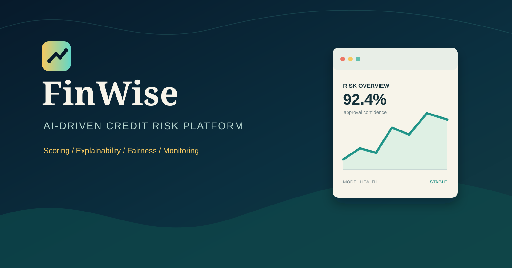

# 📈 FinWise | AI-Driven Credit Risk Analysis & Scoring Engine

FinWise, finansal veri setleri üzerinden makine öğrenmesi algoritmalarını kullanarak kredi riskini ve müşteri skorlamasını tahmin eden, yüksek hassasiyetli bir mühendislik projesidir. **beratt.dev** ekosisteminin fintech odaklı amiral gemisi projesi olarak tasarlanmıştır.



[](https://www.python.org/)
[](https://scikit-learn.org/)
[](https://flask.palletsprojects.com/)
[](LICENSE)

---

## ⚠️ Yasal Uyarı / Disclaimer

Bu proje **sadece eğitim ve araştırma amaçlı** paylaşılmıştır. Gerçek finansal kararlar, kredi başvuruları veya ticari uygulamalar için **kullanılamaz**. Proje kapsamında kullanılan tüm veri setleri anonimleştirilmiş, kamuya açık veya sentetiktir; **kişisel veri** veya gerçek müşteri bilgisi içermez. Proje, herhangi bir kurum veya kuruluşun ticari ürününü temsil etmez. Kullanımdan doğabilecek herhangi bir zarardan yazar(lar) sorumlu değildir.

This project is **for educational and research purposes only**. It must not be used for real financial decisions, credit applications, or commercial deployment. All datasets are anonymized, public, or synthetic; **no personal or customer data** is included. The project does not represent any commercial product. The author(s) are **not liable** for any damages arising from use.

Lisans: MIT — Ayrıntılar için LICENSE dosyasına bakınız.

---

## 🎯 Projenin Amacı

Geleneksel kredi değerlendirme süreçleri yavaş ve hata payı yüksek olabilmektedir. FinWise, geçmiş finansal verileri (gelir düzeyi, kredi geçmişi, demografik veriler vb.) analiz ederek bir müşterinin temerrüde düşme olasılığını saniyeler içinde tahmin eder.

### Temel Özellikler
- **Veri Ön İşleme (Preprocessing):** Kayıp verilerin doldurulması, aykırı değer analizi ve özellik ölçeklendirme.
- **Model Eğitimi:** Lojistik Regresyon, Random Forest ve XGBoost algoritmalarının karşılaştırmalı analizi.
- **Gerçek Zamanlı API:** Flask tabanlı REST API ile modelin diğer sistemlere entegrasyonu.
- **Performans Metrikleri:** Karmaşıklık Matrisi (Confusion Matrix), ROC-AUC eğrisi ve F1-Skoru üzerinden model validasyonu.

---

## 🔬 Matematiksel Temel

FinWise, temelinde olasılıksal bir sınıflandırma modeli kullanır. Modelimiz, bir müşterinin kredi riskini ($y=1$) tahmin etmek için şu lojistik fonksiyonu ($sigmoid$) baz alır:

$$P(y=1 | X) = \frac{1}{1 + e^{-(w^T X + b)}}$$

Burada $w$ ağırlık vektörünü, $X$ ise müşterinin finansal özelliklerini temsil eder. Model, maliyet fonksiyonunu (Log-Loss) minimize ederek en doğru tahmin parametrelerine ulaşır.

---

## 🚀 Teknik Stack

- **Dil:** Python 3.x
- **Kütüphaneler:** Pandas, NumPy, Scikit-learn, Matplotlib, Seaborn
- **API:** Flask (Deployment hazır)
- **Deployment:** [Vercel/Heroku/Docker - Tercihinize göre düzenleyin]

---

## 📊 Model Performansı

Eğitilen modelimiz test verisi üzerinde şu sonuçlara ulaşmıştır:

| Metrik | Değer |
| :--- | :--- |
| **Accuracy (Doğruluk)** | %93.03 |
| **F1-Score** | %96 |
| **ROC-AUC** | 0.XX |

| Precision (Onaylanan) | %93 |
| Recall (Onaylanan) | %99 |
| F1-Score (Onaylanan) | %96 |
| Precision (Reddedilen) | %96 |
| Recall (Reddedilen) | %72 |
| F1-Score (Reddedilen) | %82 |

---

## ⚙️ Kurulum ve Kullanım

1. Projeyi klonlayın:
   ```bash
   git clone https://github.com/berat1834/finwise-ml-platform.git
   ```
2. Gerekli kütüphaneleri yükleyin:
   ```bash
   pip install -r requirements.txt
   ```
3. Modeli eğitin veya hazır modeli kullanın:
   ```bash
   python kredi_basvuru_sistemi.py
   ```
4. Web sunucusunu başlatın:
   ```bash
   python app.py
   ```
5. Tarayıcıdan `http://localhost:5000` adresine gidin.

### API Kullanımı

**Endpoint:** `POST http://localhost:5000/degerlendir`

**Request Body:**
```json
{
    "person_age": 30,
    "person_income": 50000,
    "person_emp_length": 5,
    "loan_amnt": 10000,
    "loan_int_rate": 7.5,
    "loan_percent_income": 0.2,
    "cb_person_cred_hist_length": 8,
    "person_home_ownership": "RENT",
    "loan_intent": "PERSONAL",
    "loan_grade": "B",
    "cb_person_default_on_file": "N"
}
```

**Response:**
```json
{
    "tahmin": "ONAYLANDI",
    "onay_olasiligi": 0.92,
    "red_olasiligi": 0.08
}
```

#### AI Risk Assistant (Yeni)

Risk analistleri için doğal dil açıklama endpoint'leri:

- `POST /api/v2/ai-risk-explanation`
- `POST /api/v2/fairness-summary`
- `POST /api/v2/ai-risk-assistant`

##### Hızlı Ortam Ayarı

`.env` dosyanıza aşağıdaki alanları ekleyin (veya `.env.example` kopyalayın):

```env
AI_ASSISTANT_PROVIDER=
OPENAI_API_KEY=
OPENAI_MODEL=gpt-4o-mini
ANTHROPIC_API_KEY=
ANTHROPIC_MODEL=claude-3-5-sonnet-latest
```

Notlar:
- `AI_ASSISTANT_PROVIDER` boş bırakılırsa sistem deterministic (yerel) modda çalışır.
- `AI_ASSISTANT_PROVIDER=openai` veya `AI_ASSISTANT_PROVIDER=anthropic` seçilirse ilgili API key ile LLM modu aktif olur.

##### Örnek İstek (`/api/v2/ai-risk-assistant`)

```json
{
   "question": "Why was this loan rejected?",
   "application_id": 123,
   "fairness_context": {
      "disparate_impact_ratio": 0.79,
      "demographic_parity_difference": 0.09,
      "equal_opportunity_difference": 0.07
   }
}
```

---

## 📁 Dosya Yapısı

```
FinWise-ML Projem/
├── kredi_basvuru_sistemi.py        # Ana sistem (CLI)
├── app.py / app_v2_secure.py       # Flask web sunucusu
├── index.html / index_v2.html      # Web arayüzü
├── credit_risk_dataset.csv         # Eğitim verisi
├── model_fairness.joblib           # Eğitilmiş model
├── requirements.txt                # Gereken kütüphaneler
├── .env.example                    # Ortam değişkeni örneği
└── README.md                       # Bu dosya
```

---

## 🎯 Örnek Senaryolar

### Senaryo 1: Başarılı Başvuru
- **Yaş:** 35
- **Gelir:** $80,000
- **İş Deneyimi:** 10 yıl
- **Kredi Miktarı:** $15,000
- **Kredi Notu:** A
- **Sonuç:** ✅ ONAYLANDI (%95 olasılık)

### Senaryo 2: Riskli Başvuru
- **Yaş:** 22
- **Gelir:** $25,000
- **İş Deneyimi:** 1 yıl
- **Kredi Miktarı:** $30,000
- **Kredi Notu:** E
- **Geçmiş Temerrüt:** Evet
- **Sonuç:** ❌ REDDEDİLDİ (%78 olasılık)

---

## 🔧 Teknik Gereksinimler

- Python 3.9+
- 2GB RAM (minimum)
- İnternet bağlantısı (kurulum için)

---

## 🐛 Sorun Giderme

- Model Bulunamadı Hatası: `python kredi_basvuru_sistemi.py` ile modeli eğitin.
- Flask Kurulu Değil: `pip install flask flask-cors` komutunu çalıştırın.
- Grafik Görünmüyor: `pip install matplotlib seaborn` komutunu çalıştırın.
- Port Zaten Kullanımda: `app.py` dosyasında port numarasını değiştirin.

---

## 🔐 Güvenlik Notları

- Bu sistem demo amaçlıdır.
- Gerçek üretim ortamında ek güvenlik önlemleri alınmalıdır.
- Müşteri verileri şifrelenmeli ve güvenli saklanmalıdır.
- GDPR ve yerel veri koruma yasalarına uyulmalıdır.

---

## 📝 Lisans

MIT Lisansı — Ayrıntılar için LICENSE dosyasına bakınız.

---

## 👨‍💻 Geliştirici

Berat — Machine Learning Project

---

## 🤝 Katkıda Bulunma

1. Fork yapın
2. Feature branch oluşturun (`git checkout -b feature/yeniOzellik`)
3. Değişikliklerinizi commit edin (`git commit -am 'Yeni özellik eklendi'`)
4. Branch'inizi push edin (`git push origin feature/yeniOzellik`)
5. Pull Request oluşturun

---

## 📞 İletişim

Sorularınız için issue açabilirsiniz.

---

⭐ Projeyi beğendiyseniz yıldız vermeyi unutmayın!

---

### Bu README'yi Yükledikten Sonra Yapman Gerekenler:

1.  **Metrikleri Güncelle:** Tablodaki `%XX.X` kısımlarına kendi modelinden aldığın doğruluk skorlarını yaz. (Gerçekçi rakamlar her zaman daha çok güven verir.)
2.  **Görseller:** Modelin eğitim aşamasından bir grafik (örneğin *Feature Importance* veya *ROC Curve*) görselini `images/` klasörüne atıp README'ye ekleyebilirsin.
3.  **Requirements:** Projende kullandığın kütüphanelerin listesini içeren bir `requirements.txt` dosyasının ana dizinde olduğundan emin ol.

**FinWise** şimdi çok daha ağırbaşlı ve profesyonel duruyor! 

Sırada ne var Berat? GitHub profilinin ana kapak sayfasını (**Profile README**) mı yapalım, yoksa web siten için içerik mi üretelim?
